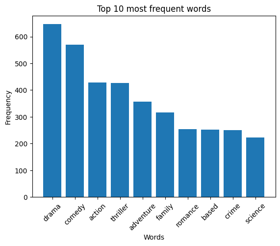
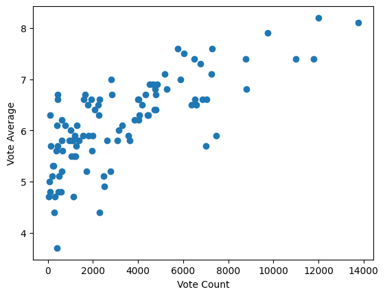
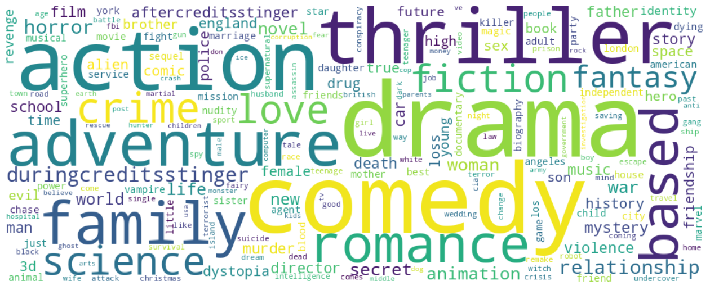

# TMDB 5000 Movie Recommendation System

**Author:** Sevendi Eldrige Rifki Poluan

## Project Overview


This project implements a **hybrid movie recommendation system** using the TMDB 5000 Movie Dataset. The system combines collaborative filtering and content-based filtering approaches to provide personalized movie recommendations based on a user's recently watched movie.

The TMDB 5000 Movie Dataset is a popular collection of movie data containing information about over 5000 movies. It includes comprehensive details such as:
- Movie titles and release dates
- Genres and keywords
- Budgets and revenues
- Ratings and vote counts
- Cast and crew information
- Production companies
- Movie overviews and taglines

## Hybrid Recommendation Approach

This system implements a **three-stage filtering methodology** to recommend similar movies:

### Stage 1: Content-Based Filtering (Keywords, Genres, Taglines)
- Filters the top 100 similar movies using **keywords**, **taglines**, and **genres**
- Uses CountVectorizer to encode textual features
- Applies cosine similarity to find related content

### Stage 2: Quality-Based Filtering (Vote Counts)
- Selects the top 50 movies from the 100 candidates based on quality metrics
- Implements weighted rating formula to balance vote counts and average ratings:
  ```
  Weighted Rating (WR) = (v / (v + m)) * R + (m / (v + m)) * C
  ```
  Where:
  - **v** = number of votes received by the movie
  - **m** = minimum votes required (95th percentile)
  - **R** = average rating of the movie
  - **C** = mean vote across all movies

### Stage 3: Content-Based Filtering (Movie Overview)
- Performs final filtering based on overview similarity
- Uses TF-IDF vectorization to extract important words from movie descriptions
- Selects the top 15 most similar movies based on plot content
- Provides more refined recommendations with similar storylines


## Dataset

The TMDB 5000 Movie Dataset can be downloaded from Kaggle at:
https://www.kaggle.com/datasets/tmdb/tmdb-movie-metadata?resource=download

The dataset includes two main CSV files:
- `tmdb_5000_movies.csv` - Movie information and metadata
- `tmdb_5000_credits.csv` - Cast and crew details

## How It Works

1. **Input**: User provides a movie title they recently watched
2. **Stage 1**: System finds 100 movies with similar keywords, genres, and themes
3. **Stage 2**: Narrows down to top 50 movies based on weighted quality ratings
4. **Stage 3**: Final recommendation of 15 movies with similar plot overviews
5. **Output**: Sorted list of 15 recommended movies

## Advantages of This Approach

- **Multi-layered Filtering**: Combines different recommendation strategies for robust results
- **Quality Assurance**: Filters by vote counts to ensure popular, well-rated movies
- **Content Relevance**: Uses multiple textual features (keywords, genres, overviews) for accurate matching
- **Balanced Recommendations**: Considers both popularity metrics and content similarity

## Visualizations and Analysis

### Figure 1: WordCloud - Movie Themes and Keywords


The word cloud above displays the most frequently occurring words extracted from the combined keywords, genres, and taglines of movies in the TMDB dataset. 

**Insights:**
- **Dominant Themes**: Words like "drama," "thriller," "action," and "romance" dominate, indicating these are the most common genres in the dataset
- **Key Story Elements**: Common keywords such as "love," "family," "crime," and "adventure" represent popular movie themes
- **Word Size**: The size of each word is proportional to its frequency - larger words appear more frequently across movies
- **Feature Importance**: This visualization helps understand the feature space used in Stage 1 of the recommendation system, where keywords and genres are matched using CountVectorizer

**Usage**: This wordcloud is used as a reference image in the project documentation and helps visualize the movie metadata landscape.

---

### Figure 2: Top 10 Most Frequent Words in Movie Features



This bar chart displays the 10 most frequently occurring words across all movie keywords, genres, and taglines in the dataset.

**Insights:**
- **High-Frequency Words**: The top words appear hundreds of times across the dataset
- **Genre Dominance**: Genre-related words occupy the top positions, showing that genres are the most consistent categorical feature
- **Recommendation Relevance**: These frequent words have the highest discriminative power in Stage 1 filtering
- **Feature Weighting**: Words with higher frequencies contribute more significantly to similarity calculations in content-based filtering
- **Optimization Target**: This analysis helps identify which features should be emphasized in the recommendation algorithm

**Method Used**: CountVectorizer with English stop words removed (filtered out common words like "the", "and", "a", etc.)

---

### Figure 3: Vote Count vs Vote Average Distribution



This scatter plot shows the relationship between the number of votes (vote count) and average rating (vote average) for movies in the filtered dataset.

**Insights:**
- **Distribution Pattern**: Movies cluster in different regions showing the relationship between popularity and rating
- **Quality Filtering**: Stage 2 uses the 95th percentile of vote count (shown on the x-axis) as the threshold `m` for the weighted rating formula
- **Quality Assurance**: The vertical distribution at different vote counts shows varying ratings - this is why weighted rating is necessary
- **Correlation**: There's a general trend where more votes often correlate with stable, moderate ratings (regression to the mean)
- **Recommendation Logic**: 
  - Movies with few votes but high ratings are weighted down (unreliable ratings)
  - Movies with many votes are weighted up (validated by community)
  - The formula balances these factors: WR = (v/(v+m)) × R + (m/(v+m)) × C

**Formula Explanation**: 
```
Weighted Rating = (vote_count / (vote_count + minimum_votes)) × movie_rating + 
                  (minimum_votes / (vote_count + minimum_votes)) × mean_rating
```
This ensures that recommendations are based on well-rated AND well-reviewed movies.

---

### Figure 4: WordCloud - Final Output Example



This second wordcloud represents the combined features of the top 50 recommended movies after Stage 2 filtering, demonstrating the refined feature space used in Stage 3.

**Insights:**
- **Refined Themes**: Compared to the full dataset wordcloud, this shows filtered themes relevant to the query movie
- **Recommendation Context**: These are the dominant words in movies similar to the user's selection
- **Quality-Adjusted Features**: Reflects only high-quality, highly-rated movies (after weighted rating filter)
- **Stage 3 Input**: These words form the basis for the final TF-IDF vectorization and cosine similarity calculation in Stage 3

---

## Data Processing Pipeline

### Step-by-Step Workflow

```
Raw Movie Data
    ↓
[Stage 1] CountVectorizer on Keywords/Genres/Taglines
    ↓
Cosine Similarity Calculation
    ↓
Select Top 100 Similar Movies
    ↓
[Stage 2] Calculate Weighted Ratings (WR)
    ↓
Sort by WR Score
    ↓
Select Top 50 Movies
    ↓
[Stage 3] TF-IDF Vectorization on Movie Overviews
    ↓
Cosine Similarity on Overviews
    ↓
Select Top 15 Final Recommendations
    ↓
Output: Recommended Movies List
```

### Technical Implementation Details

**Stage 1 - Vectorization:**
- Extracts and combines keywords, genres, and taglines from JSON-formatted fields
- Uses scikit-learn's CountVectorizer with English stop words removal
- Generates sparse matrix of word frequencies
- Applies cosine similarity to find nearest neighbors

**Stage 2 - Quality Weighting:**
- Calculates weighted rating using IMDb-inspired formula
- Uses 95th percentile of vote count as reference point
- Balances popularity and quality metrics
- Sorts candidates by weighted score

**Stage 3 - Overview Analysis:**
- Cleans text: removes numbers, special characters, converts to lowercase
- Uses TF-IDF (Term Frequency-Inverse Document Frequency) vectorizer
- TF-IDF advantages: prioritizes words that are:
  - Frequent in the target movie's overview
  - Rare across the entire dataset (more distinctive)
- Final cosine similarity provides refined, plot-based recommendations

---

## References

### Foundational Papers & Resources

1. **GroupLens Research - MovieLens Datasets**
   - URL: [https://grouplens.org/datasets/movielens/](https://grouplens.org/datasets/movielens/)
   - Standard benchmark datasets widely used in recommendation system research.

2. **The Movie Database (TMDB)**
   - URL: [https://www.themoviedb.org/](https://www.themoviedb.org/)
   - Comprehensive movie metadata and information source.

### Key Techniques Used in This Project

**Content-Based Filtering:**
- Text vectorization using CountVectorizer and TF-IDF
- Cosine similarity for measuring document and content similarity
- Feature extraction from keywords, genres, taglines, and overviews

**Collaborative Filtering:**
- Weighted rating methodology incorporating vote counts and averages
- Ranking and quality filtering based on user engagement metrics

**Text Processing:**
- Scikit-learn stop words removal
- Text normalization and cleaning
- Feature engineering for better similarity matching

### Recommended Reading

For detailed understanding of recommendation system methodologies, consider exploring:
- Scikit-learn documentation on text feature extraction and vectorization
- ACM Recommender Systems Research Community resources
- Netflix Prize competition papers and findings
- Research on hybrid recommendation approaches


### Notes

This project implements practical techniques commonly used in production recommendation systems. For academic rigor, researchers should verify cited methodologies and performance metrics through peer-reviewed publications and established benchmarks.
